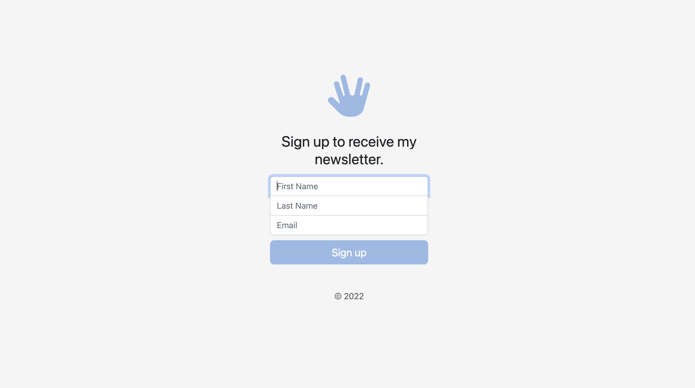

# Newsletter Signup

This is a solution to the Newsletter Signup challenge in [The Complete 2022 Web Development Bootcamp](https://www.udemy.com/course/the-complete-web-development-bootcamp/) taught by Angelu Yu of [The App Brewery](https://appbrewery.com/).

## Table of contents

- [Overview](#overview)
  - [The challenge](#the-challenge)
  - [Screenshot](#screenshot)
  - [Links](#links)
- [My process](#my-process)
  - [Built with](#built-with)
  - [What I learned](#what-i-learned)
- [Author](#author)

## Overview

### The challenge

Users should be able to:

- Enter their name and email address in a form to signup to my Newsletter hosted on [Mailchimp](https://mailchimp.com/developer/)
- Receive a confirmation or error message in response to their request

### Screenshot

### Links

- Solution URL: [Newsletter Signup](https://desolate-meadow-84776.herokuapp.com/)

## My process

### Built with

Front End:
- HTML markup
- CSS custom properties
- [Bootstrap](https://getbootstrap.com/docs/5.2/forms/overview/) - for styles

Back End:
- Node.js
- Express Server
- Body-Parser
- Mailchimp API

### What I learned

I used this project to practice building a back-end application using Node.js, Express for the server, Body-Parser to parse the form data received on the back-end, and the Mailchimp API to add a new subscriber to my newsletter and receive confirmation or error messages that I can then pass on to the user on the front-end.

## Author

- Website - [Mollibeth Cardwell](https://www.mollibeth.dev)
